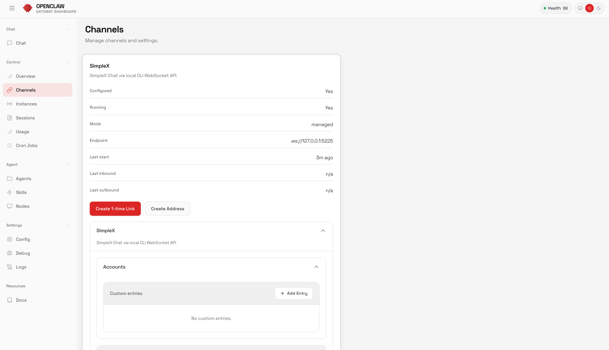

# @dangoldbj/openclaw-simplex

> **TL;DR:** Run OpenClaw agents over SimpleX with no phone numbers, no hosted bot APIs, and full end-to-end encryption.

Privacy-first SimpleX messaging channel for OpenClaw.

This plugin enables OpenClaw agents to communicate over SimpleX, a decentralized, end-to-end encrypted messaging network, without requiring phone numbers, hosted bot APIs, or third-party infrastructure.

It introduces a new class of channel for OpenClaw: **local-first, self-hostable, and identity-minimal agent communication.**

## Why this plugin exists

OpenClaw supports multiple messaging channels, but most rely on:

- phone numbers or platform-bound identities
- hosted bot APIs
- centralized infrastructure

This plugin adds support for SimpleX, enabling:

- fully end-to-end encrypted messaging
- no global identifiers, so no phone or email is required
- self-hosted or local-first operation
- agent communication without third-party dependencies

**This fills a gap for privacy-sensitive and self-hosted OpenClaw deployments.**

## Why SimpleX

SimpleX is uniquely suited for privacy-critical communication:

- no user identifiers, so no phone or email
- end-to-end encrypted by default
- decentralized relay architecture
- supports self-hosting

This plugin integrates SimpleX into OpenClaw as a production-ready channel backed by the official `simplex-chat` CLI.

## What this plugin provides

- send and receive messages, including text and media
- pairing and allowlist support
- invite link and QR generation
- message actions and responses
- runtime status and lifecycle management
- Control UI configuration
- managed or external runtime modes

## Use Cases

- running OpenClaw agents in fully self-hosted environments
- privacy-sensitive workflows with no external messaging providers
- peer-to-peer agent communication without global identifiers
- secure local automation systems
- experimental decentralized agent networks

## Install

### 1. Install SimpleX CLI (`simplex-chat`)

Official installer:

```bash
curl -o- https://raw.githubusercontent.com/simplex-chat/simplex-chat/stable/install.sh | bash
```

If the official installer resolves the wrong Darwin/Linux target:

```bash
curl -o- https://raw.githubusercontent.com/dangoldbj/simplex-chat/install-arch-matrix/install.sh | bash
```

Verify:

```bash
simplex-chat -h
```

### 2. Install plugin

```bash
npm i @dangoldbj/openclaw-simplex
# or
pnpm add @dangoldbj/openclaw-simplex
# or
yarn add @dangoldbj/openclaw-simplex
```

### 3. Install in OpenClaw

```bash
openclaw plugins install @dangoldbj/openclaw-simplex
```

Enable:

```bash
openclaw plugins enable simplex
```

Trust plugin:

```bash
openclaw config set plugins.allow '["simplex"]' --strict-json
```

Important:

- `openclaw plugins enable simplex` only enables the plugin.
- OpenClaw will not start the SimpleX channel until `channels.simplex.connection` is configured.
- The current Control UI SimpleX card is a config editor, not a guided setup wizard.
- `openclaw channels add --channel simplex --cli-path simplex-chat` works.
- The interactive `openclaw channels add` picker may not list this external plugin yet.

## How It Works

1. OpenClaw loads the plugin and registers the `simplex` channel.
2. OpenClaw can load the lightweight setup entry before the full runtime entry for disabled or unconfigured channels.
3. The channel only becomes startup-capable after `channels.simplex.connection` is configured.
4. The plugin connects to SimpleX via the CLI WebSocket API.
5. Incoming messages are normalized into OpenClaw context.
6. OpenClaw applies policies such as `dmPolicy` and `allowFrom`.
7. Responses are sent back through SimpleX.

## Architecture

```text
            +-------------------------+
            |        OpenClaw         |
            |  (agent + router/core)  |
            +------------+------------+
                         |
                         | channel plugin API
                         v
            +-------------------------+
            | @dangoldbj/openclaw-    |
            |        simplex          |
            | - inbound monitor       |
            | - outbound actions      |
            | - policy enforcement    |
            | - account/runtime state |
            +------------+------------+
                         |
                         | WebSocket API
                         v
            +-------------------------+
            |   SimpleX CLI Runtime   |
            |      (simplex-chat)     |
            +------------+------------+
                         |
                         | network
                         v
            +-------------------------+
            |      SimpleX Network    |
            +-------------------------+
```

## External vs Managed Modes

### Managed mode (OpenClaw runs SimpleX)

```json
{
  "channels": {
    "simplex": {
      "enabled": true,
      "connection": {
        "mode": "managed",
        "cliPath": "simplex-chat",
        "wsHost": "127.0.0.1",
        "wsPort": 5225
      },
      "allowFrom": ["*"]
    }
  }
}
```

### External mode (you run SimpleX separately)

```json
{
  "channels": {
    "simplex": {
      "enabled": true,
      "connection": {
        "mode": "external",
        "wsUrl": "ws://127.0.0.1:5225"
      },
      "allowFrom": ["*"]
    }
  }
}
```

## Security Model

- channel-level sender gating such as `dmPolicy` and `allowFrom`
- pairing-based approval flow
- explicit control over runtime boundaries
- no reliance on external messaging APIs

## Example Commands

```bash
openclaw plugins list
openclaw plugins info simplex
openclaw channels add --channel simplex --cli-path simplex-chat
openclaw pairing list
```

Invite APIs:

- `simplex.invite.create`
- `simplex.invite.list`
- `simplex.invite.revoke`

## Troubleshooting

- plugin not visible: check `plugins.allow` and `openclaw plugins list`
- channel not starting: verify `channels.simplex.connection` exists and points to a working SimpleX runtime
- `Configured No`: add explicit `channels.simplex.connection` config; plugin defaults alone are not enough for OpenClaw startup
- inbound issues: review policies such as `allowFrom`, `dmPolicy`, and group policy
- media issues: validate URLs and size limits

## Happy Path

1. Open `Control -> Channels -> SimpleX`.
2. Configure SimpleX in managed mode.
3. Generate an invite link or QR code.
4. Connect via the SimpleX app.
5. Approve pairing in OpenClaw.
6. Send a message and verify the response.

Full walkthrough:

- https://dangoldbj.github.io/openclaw-simplex/guide/getting-started

## Screenshots

Control UI channel view:



More screenshots:

- https://dangoldbj.github.io/openclaw-simplex/guide/getting-started

## Full Docs

- https://dangoldbj.github.io/openclaw-simplex/
